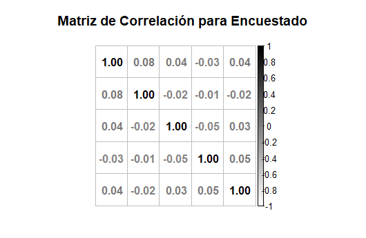
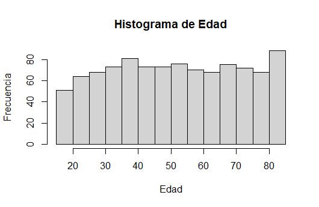
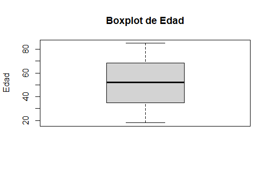

## Conexión de R con MySQL

Para realizar la conexión de R con MySQL primero tenemos que instalar una paquetería llamada "RMySQL":

```R
#Instalar el paquete RMySQL para realizar la conexión con R
install.packages("RMySQL")
library(RMySQL)
```

En esta librería se encuentra una función cuyo nombre es "dbConnect" de la cual, nos pide que pongamos nuestro usuario, contraseña, nombre de la base de datos y el host. Para mayor facilidad, esta conexión se le asigna a una variable para futuras operaciones:

```R
# La función dbConnect nos permite realizar la conexión con MySQL
conexion <- dbConnect(MySQL(),
                      user = "root",
                      password = "",
                      dbname = "ensu",
                      host = "localhost")
```

Si queremos validar que tablas son las que se encuentran en nuestra base de datos tenemos que usar la función "dbListTables" poniendo como único parámetro la conexión que se realizó en el paso anterior. Para poder extraer la información de una tabla tenemos que agregar la conexión y el nombre de la tabla entre comillas:

```R
#dbListTables nos permite ver los nombres de las tablas de nuestra BD
dbListTables(conexion)

#Para extraer el nombre de la tabla que ocupamos, se necesita poner entre "" el nombre de esta
encuestado <- dbReadTable(conexion, "encuestado")
resultado <- dbReadTable(conexion, "resultado")
encuesta <- dbReadTable(conexion, "encuesta")
ubicacion <- dbReadTable(conexion, "ubicacion")
```

Un ejemplo de los primeros 3 datos de cada tabla:

**Encuestado:**

| Id_Encuestado 	| Genero    |Edad    |Fecha_Nacimiento    |Ocupacion    |Grado_Estudio    |Numero_Mudanza    |Id_Ubicacion    |
|---	|---	|---	|---	|---	|---	|---	|---	|
|1	|1	|49	|21/06/1973	|5	|2	|0	|68|
|2	|1	|43	|01/05/1980	|2	|3	|0	|14|
|3	|2	|29	|04/12/1993	|3	|3	|0	|26|

**Resultado:**

|Id_Resultado	|Percepcion_Seguridad_Publica	|Confianza_Administración_Publica	|Percepcion_Inseguridad_Publica	|Percepcion_Incivilidades_Entorno	|Id_Encuesta
|---	|---	|---	|---	|---	|---	|
|1	|2	|9	|9	|9	|127|
|2	|9	|2	|2	|1	|860|
|3	|9	|4	|1	|9	|453|

**Encuesta:**

|Id_Encuesta	|Periodo_Encuesta	|Id_Encuestado|
|---	|---	|---	|
|1	|123	|888|
|2	|123	|664|
|3	|123	|274|

**Ubicacion:**

|Id_Ubicacion	|Localidad	|Municipio	|Estado|
|---	|---	|---	|---	|
|1	|AGUASCALIENTES	|AGUASCALIENTES	|AGUASCALIENTES|
|2	|AGUASCALIENTES	|JESUS MARIA	|AGUASCALIENTES|
|3	|MEXICALI	|MEXICALI	|BAJA CALIFORNIA|

Para el apartado de consultas relevantes, se me hizo de suma importancia obtener la correlación entre variables, para ello, utilice la función corrplot para graficar y la función cor para obtener la matriz de correlación:

```R
#Consultas Relevantes
#Calcular la correlación entre variables
library(corrplot)

#Tenemos que asegurarnos que las variables sean de tipo numerico
encuestado$Ocupacion <- as.numeric(encuestado$Ocupacion) 
encuestado$Grado_Estudio <- as.numeric(encuestado$Grado_Estudio)
encuestado$Numero_Mudanza <- as.numeric(encuestado$Numero_Mudanza)

#Graficar la matriz de correlacion 
corrplot(cor(encuestado[!names(encuestado) %in% c("Id_Encuestado","Fecha_Nacimiento","Id_Ubicacion")]),
         method = "number",
         type = "full",
         title = "Matriz de Correlación para Encuestado",
         tl.pos = "n", mar = c(2, 1, 3, 1),
         col = colorRampPalette(c("white", "black"))(100))
```

**Grafico de correlación:**



En el paso de operaciones de agregación, me di la tarea de crear un ciclo que me dé una tabla con los valores de estas operaciones y me grafique el histograma y el boxplot de estos datos. Este ciclo se alimenta de una variable macro que, como datos, tomara todas aquellas variables a las cuales se le desee obtener este análisis. 

Para este ejercicio se realizó solo para la variable "Edad" pero en el dado caso que se hubiera querido obtener el análisis para tres variables, el único cambio que se tendría que realizar es; en los parámetros solicitados por el for, en la lista, se tendría que agregar las demás variables, por ejemplo: ``` for (variable in c("Edad","Ocupación","Numero_Mudanza"))```.

```R
# Operaciones de Agregacion
# El siguiente ciclo creara una tabla llamada Analisis_Variable en la cual, contendra difetentes
# operaciones de agregacion.
# Tambien graficara el histograma y el boxplot de esta variable
# Nota: para querer mas de una tabla de analisis se le tiene que agregar al for el nombre
# de las variables que se ocupan, para este ejercicio se realizo solo para 1

for (variable in c("Edad")) {
  eval(parse(text = paste0("Analisis_",variable," <- data.frame(Variable = c(\"Maximo\",
                                         \"Minimo\",
                                         \"Rango\",
                                         \"Media\",
                                         \"Mediana\",
                                         \"Moda\",
                                         \"Q1\",
                                         \"Q2\",
                                         \"Q3\",
                                         \"Varianza\",
                                         \"Desviacion\",
                                         \"Coeficiente de Variación\"),
                            Dato = c(max(encuestado$",variable,"),
                                     min(encuestado$",variable,"),
                                     (max(encuestado$",variable,") - min(encuestado$",variable,")),
                                     mean(encuestado$",variable,"),
                                     median(sort(encuestado$",variable,")),
                                     names(table(encuestado$",variable,"))[table(encuestado$",variable,") == max(table(encuestado$",variable,"))],
                                     quantile(encuestado$",variable,", 0.25),
                                     quantile(encuestado$",variable,", 0.5),
                                     quantile(encuestado$",variable,", 0.75),
                                     round(var(encuestado$",variable,"),3),
                                     round(sqrt(var(encuestado$",variable,")),3),
                                     round(((sd(encuestado$",variable,") / mean(encuestado$",variable,")) * 100),3)))")))
  
  eval(parse(text = paste0("hist(encuestado$",variable,", breaks = \"FD\", main = \"Histograma de ",variable,"\", xlab = \"",variable,"\", ylab = \"Frecuencia\")")))
  eval(parse(text = paste0("boxplot(encuestado$",variable,", main = \"Boxplot de ",variable,"\", ylab = \"",variable,"\")")))
}
```

**Tabla Analisis Edad:**

|Variable|Dato|
|---	|---	|
|Maximo|85|
|Minimo|0|
|Rango|85|
|Media|51.371|
|Mediana|51|
|Moda|84|
|Q1|34.75|
|Q2|51|
|Q3|68|
|Varianza|405.845|
|Desviacion|20.146|
|Coeficiente de Variación|39.216|

**Histograma para Edad:**



**Boxplot para Edad:**



Por ultimo, para cerrar la conexion con MySQL se tiene que ejecutar el siguiente codigo:

```R
# Desconectarse de MySQL
dbDisconnect(conexion)
```
