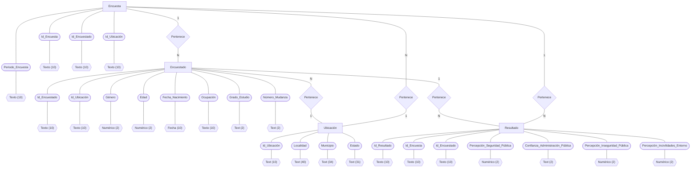

```mermaid
flowchart TD
    Encuesta
    Encuesta --- Atributo1([Id_Encuesta])
    Encuesta --- Atributo2([Id_Encuestado])
    Encuesta --- Atributo21([Id_Ubicación])
    Encuesta ---- Atributo3([Periodo_Encuesta])

    Atributo1 --- id1{{"Texto (10)"}}
    Atributo2 --- id2{{"Texto (10)"}}
    Atributo21 --- id21{{"Texto (10)"}}
    Atributo3 --- id3{{"Texto (10)"}}


    Encuestado
    Encuestado --- At1([Id_Encuestado])
    Encuestado --- At13([Id_Ubicación])
    Encuestado --- At2([Género])
    Encuestado --- At3([Edad])
    Encuestado --- At4([Fecha_Nacimiento])
    Encuestado --- At5([Ocupación])
    Encuestado --- At6([Grado_Estudio])
    Encuestado --- At7([Número_Mudanza])

    At1 --- At_id1{{"Texto (10)"}}
    At13 --- At_id13{{"Texto (10)"}}
    At2 --- At_id2{{"Numérico (2)"}}
    At3 --- At_id3{{"Numérico (2)"}}
    At4 --- At_id4{{"Fecha (10)"}}
    At5 --- At_id5{{"Texto (10)"}}
    At6 --- At_id6{{"Text (2)"}}
    At7 --- At_id7{{"Text (2)"}}


    Ubicación
    Ubicación --- U_At1([Id_Ubicación])
    Ubicación --- U_At2([Localidad])
    Ubicación --- U_At3([Municipio])
    Ubicación --- U_At4([Estado])

    U_At1 --- U_id1{{"Text (10)"}}
    U_At2 --- U_id2{{"Text (40)"}}
    U_At3 --- U_id3{{"Text (34)"}}
    U_At4 --- U_id4{{"Text (31)"}}


    Resultado
    Resultado --- R_At1([Id_Resultado])
    Resultado --- R_At2([Id_Encuesta])
    Resultado --- R_At21([Id_Encuestado])
    Resultado --- R_At3([Percepción_Seguridad_Pública])
    Resultado --- R_At4([Confianza_Administración_Pública])
    Resultado --- R_At5([Percepción_Inseguridad_Pública])
    Resultado --- R_At6([Percepción_Incivilidades_Entorno])

    R_At1 --- R_id1{{"Texto (10)"}}
    R_At2 --- R_id2{{"Texto (10)"}}
    R_At21 --- R_id21{{"Texto (10)"}}
    R_At3 --- R_id3{{"Numérico (2)"}}
    R_At4 --- R_id4{{"Text (2)"}}
    R_At5 --- R_id5{{"Numérico (2)"}}
    R_At6 --- R_id6{{"Numérico (2)"}}

    Encuesta -- 1 --- Rel_Enc{Pertenece}
    Rel_Enc -- N --- Encuestado

    Encuesta -- N --- Rel_UB{Pertenece}
    Rel_UB -- 1 --- Ubicación
    
    Encuesta -- 1 --- Rel_Res{Pertenece}
    Rel_Res -- N --- Resultado

    Encuestado -- 1 --- Resul_Enc{Pertenece}
    Resul_Enc -- N --- Resultado

    Encuestado -- N --- Resul_UB{Pertenece}
    Resul_UB -- 1 --- Ubicación
```