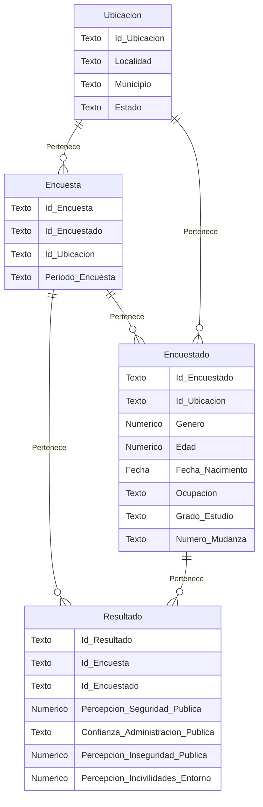

**Modelo Relacional**

1. Encuesta(Id_Encuesta,Id_Encuestado,Id_Ubicación,Periodo_Encuesta)
2. Encuestado(Id_Encuestado,Id_Ubicación,Género,Edad,Fecha_Nacimiento,Ocupación,Grado_Estudio,Número_Mudanza)
3. Ubicación(Id_Ubicación,Localidad,Municipio,Estado)
4. Resultado(Id_Resultado,Id_Encuesta,Id_Encuestado,Percepción_Seguridad_Pública,Confianza_Administración_Pública,Percepción_Inseguridad_Pública,Percepción_Incivilidades_Entorno)

**Diagrama Relacional**
